# Performance testing

## Introduction

The following is the code, methodology and results for performance tests of a simple JSON API implemented in a variety of languages and frameworks.

The different test APIs are in source under implementations, performance testing scripts are under test-scripts.

## Implementation

Each API implementation must return a response to a get request returning the current datetime in the content.

### HTML

Plain html file for baseline response on the server, not a real API.

### PHP

A simple PHP script returning a JSON response, not a real or extensible example of an API. Using this as baseline for testing how increasing the number and complexity of PHP scripts affects performance.

Apache vhost example:

    <VirtualHost *:80>
        DocumentRoot /var/www/src/simple-api-performance-testing/implementations/php
        SetEnv APPLICATION_ENV "development"
        <Directory /var/www/src/simple-api-performance-testing/implementations/php>
            DirectoryIndex index.php
            AllowOverride All
            Order allow,deny
            Allow from all
        </Directory>
    </VirtualHost>

### PHP ZF2

A simple PHP API using the [Zend Framework 2](http://framework.zend.com/) and the standard Zend Skeleton application with small changes to enhance performance
- [Classmap Autoloading](http://samminds.com/2012/11/zf2-performance-quicktipp-2-classmap-autoloading).

This example can be extended to a full API implementation.

Apache vhost example:

    <VirtualHost *:80>
        DocumentRoot /var/www/src/simple-api-performance-testing/implementations/php-zf2/public
        SetEnv APPLICATION_ENV "development"
        <Directory /var/www/src/simple-api-performance-testing/implementations/php-zf2/public>
            DirectoryIndex index.php
            AllowOverride All
            Order allow,deny
            Allow from all
        </Directory>
    </VirtualHost>

You must install dependencies from composer before testing:

    php composer.phar install

### Ruby Sinatra

Simple Ruby Sinatra app, running on Unicorn with 8 worker processes. Not using apache, instead run tests directly against Unicorn running on port 8080.

This is a very simple implementation which can be extended to a full API, but you would probably want to use a different Ruby framework such as Grape or Rails.

To setup you must first get the gems:

    cd ~/simple-api-performance-testing/implementations/ruby-sinatra
    bundle

Before running tests startup Unicorn:

    cd ~/simple-api-performance-testing/implementations/ruby-sinatra
    unicorn -c unicorn.conf &

Kill Unicorn by killing the master pid (in basic_unicorn.pid):

    kill QUIT 1234

### Java Dropwizard

Simple Dropwizard app, running on Jetty (included in jar). Not using apache, instead run tests directory against Jetty running on port 8080.

This implementation can be extended to a full API and dropwizard is specifically designed to create RESTful APIs handling large volumes of requests.

Compiling requires:
* JDK 1.7
* Maven

To compile:

    maven package

To run on server:

    java -jar helloworld-0.0.1-SNAPSHOT.jar server &

Kill the app using:

    ps aux | grep java
    # find pid
    kill QUIT 1234

## Testing

All performance tests are done using apache benchmark, using the scripts under test-scripts. As a base line a plain html file is also included.

## EC2 setup

Used the standard Redhat image with the following to configure:

    sudo yum install git
    cd ~
    git clone https://github.com/stevenalexander/simple-api-performance-testing.git
    sudo yum install httpd
    sudo chkconfig --levels 235 httpd on
    # uncomment NameVirtualHost *:80 and add vhost
    sudo vi /etc/httpd/conf/httpd.conf
    sudo service httpd restart
    sudo yum install php
    sudo ln -s ~/simple-api-performance-testing/implementations/ /var/www/
    # ruby setup
    sudo yum remove libyaml.x86_64
    \curl -L https://get.rvm.io | bash
    rvm requirements
    rvm install 2.0.0

### Instance sizes at time of test

<table>
    <tr>
        <th>Instance Type</th>
        <th>vCPU</th>
        <th>ECU</th>
        <th>Memory (GiB)</th>
    </tr>
    <tr>
        <td>medium</td>
        <td>1</td>
        <td>2</td>
        <td>3.75</td>
    </tr>
    <tr>
        <td>large</td>
        <td>2</td>
        <td>4</td>
        <td>7.5</td>
    </tr>
</table>

## Results

Split out ZF2 from charts as it hides other results

### Response times via Apache Bench

<table>
    <tr>
        <th>Implementation</th>
        <th colspan=2>10000 requests 10 concurrent (seconds)</th>
        <th colspan=2>100000 requests 100 concurrent (seconds)</th>
    </tr>
    <tr>
        <th>Implementation</th>
        <th>Medium</th>
        <th>Large</th>
        <th>Medium</th>
        <th>Large</th>
    </tr>
    <tr>
        <td>html</td>
        <td>4.659</td>
        <td>5.56</td>
        <td>51.114</td>
        <td>58.634</td>
    </tr>
    <tr>
        <td>php</td>
        <td>7.279</td>
        <td>8.233</td>
        <td>80.293</td>
        <td>88.331</td>
    </tr>
    <tr>
        <td>php-zf2</td>
        <td>797.618</td>
        <td>219.197</td>
        <td> </td>
        <td>5093.659</td>
    </tr>
    <tr>
        <td>ruby-sinatra</td>
        <td>19.508</td>
        <td>13.462</td>
        <td>202.547</td>
        <td>153.448</td>
    </tr>
    <tr>
        <td>java-dropwizard</td>
        <td>19.686</td>
        <td>11.516</td>
        <td>64.759</td>
        <td>51.117</td>
    </tr>
</table>

#### Medium

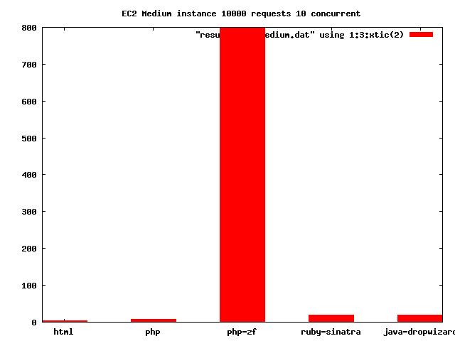

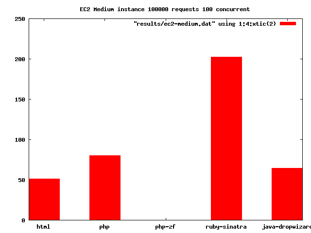

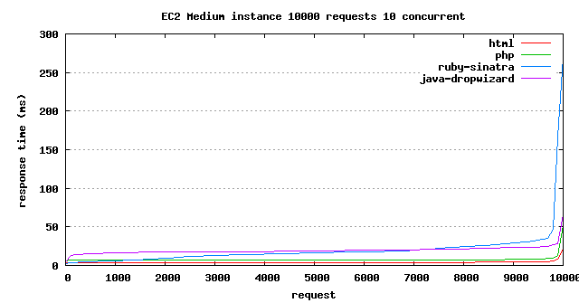

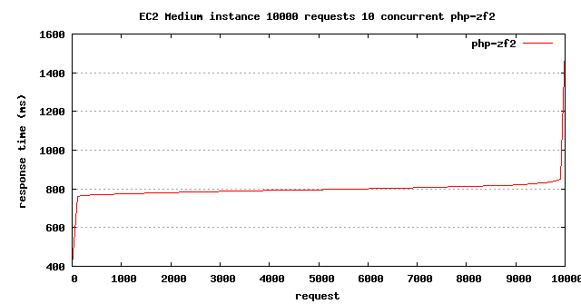

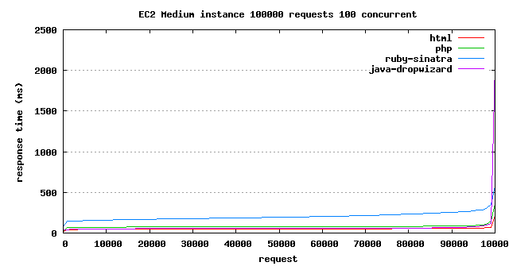

#### Large

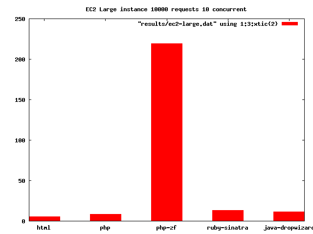

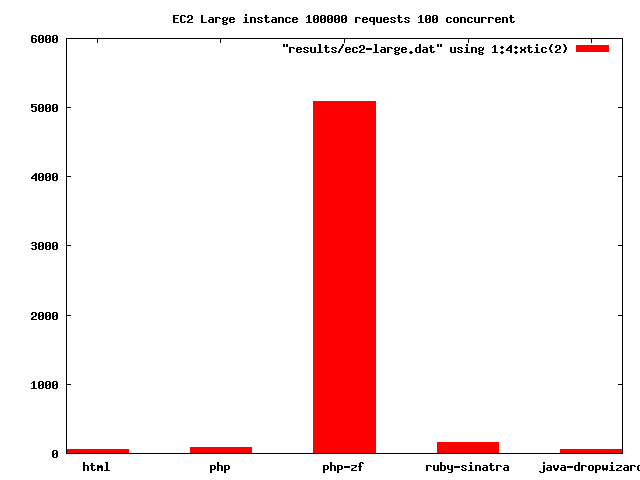

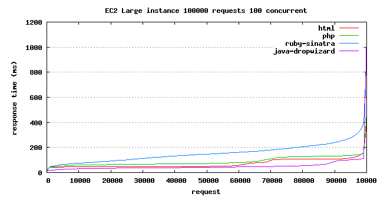

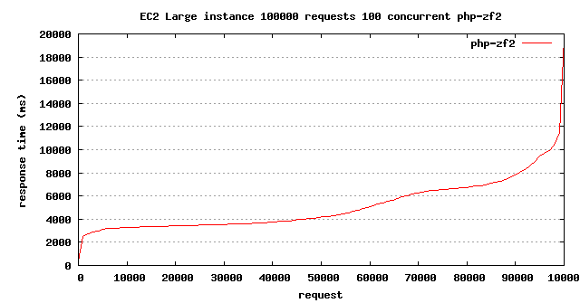

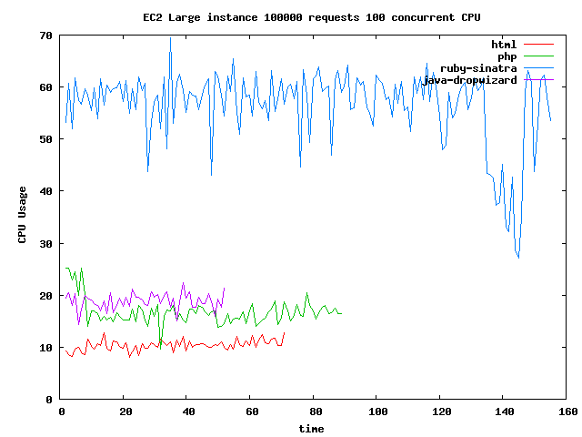

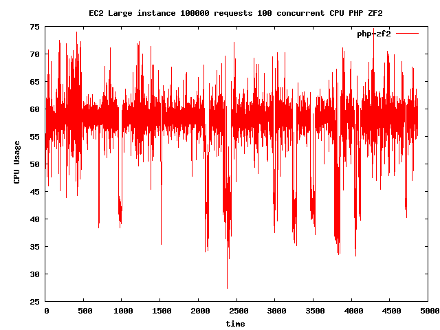

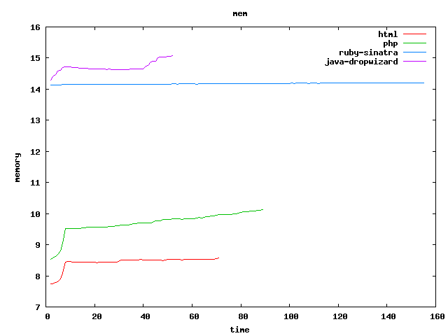

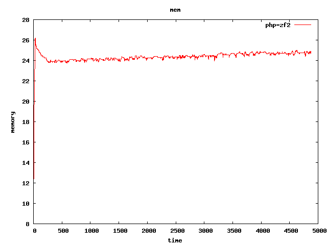

### Conclusions

Going from a single PHP script (not representative of a proper solution) to a full framework library dramatically increases the response times, CPU usage and memory usage. Under load, the request response time also increased more rapidly over time for <a href="#large">PHP ZF2</a> compared to Ruby and Java.

Average CPU usage (large instance) for PHP ZF2 was ~58%, Ruby ~57%, Java ~20%. Average memory usage PHP ZF2 ~24%, Ruby ~14%, Java 14.5%. Going to a large instance helped both PHP ZF2 and Ruby, which shows how CPU dependent the interpreted languages are.

Java Dropwizard showed the best overall performance, with a mean response time of 51ms under heavy load, compared to 151ms for Ruby and 489ms for ZF2.

For all of these implementations you could compensate for poor performance by horizontal scaling, but with Java Dropwizard you would need much less web servers compared to Ruby or ZF2, which would be a large cost saving.

## Links
* [Howto: Performance Benchmarks a Webserver](http://www.cyberciti.biz/tips/howto-performance-benchmarks-a-web-server.html)
* [Plot using gnuplot](http://tjholowaychuk.com/post/543349452/apachebench-gnuplot-graphing-benchmarks)